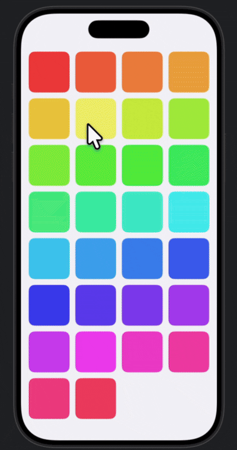
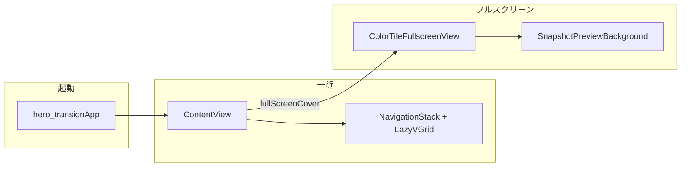

# hero-transion（デモ）

アイテムをタップした時にそのアイテムが中央に拡大表示されて遷移するHero TransionをSwiftUIとUIKitで実装したサンプルプロジェクトです。

## デモ

## アプリ構成とコードの流れ

### 全体像

- **エントリ**: `hero_transionApp`が`WindowGroup`で`ContentView()`を表示する構成です。
- **画面**: 一覧（グリッド）とフルスクリーンの「拡大プレビュー」はすべて`ContentView.swift`内の`ContentView`と`ColorTileFullscreenView`が行います。

### 背景について

背面は、遷移直前のウィンドウを**`WindowSnapshot`でキャプチャした画像を設置しています。キャプチャは**`UIApplication`**→**`UIWindowScene`**→**`UIWindow`**→**`rootViewController.view.layer`の`render`**という経路で行われます。その画像を**`SnapshotPreviewBackground`**が全面に表示しています。

### 一覧画面（`ContentView`）

1. `@Namespace`の`cardHeroNamespace`を確保し、グリッドの各セルに**`matchedTransitionSource(id:in:)`**を付与します。`id`は`ColorTile.id`（例：`tile-0`）で、セルと拡大側の「同じカード」として対応付けます。
2. `LazyVGrid`で**30個の`ColorTile`**（色相だけ変えた角丸四角）を表示します。
3. セルの**`Button`アクション**では、次の順序で処理します（コメントの「先にキャプチャ → 遷移 → 非同期で State」）。
   1. **同期で**`WindowSnapshot.captureForPreviewBackground()`を呼び、画像を取得（失敗時は`nil`）。
   2. **`selectedTile = tile`**で`fullScreenCover(item:)`を起動。
   3. **`DispatchQueue.main.async`**で`previewBackgroundSnapshot`にキャプチャを代入（遷移アニメーション開始後に背景を更新）。

### フルスクリーン（`ColorTileFullscreenView`）

1. 背面に**`SnapshotPreviewBackground(snapshot:)`**を敷き、一覧の「あるはずの場所」を静止画＋薄いオーバーレイで再現します。
2. 手前に、タップしたセルと**同じ色**の大型`RoundedRectangle`を中央に配置します（コメントどおり、本来はPDFプレビューなどの置き換え想定）。
3. **`navigationTransition(.zoom(sourceID: tile.id, in: namespace))`**で、一覧側の`matchedTransitionSource`と**同じ`id`・同じ`Namespace`**を使い、セルから中央への**ズーム系の共有要素遷移**を行います。
4. **全面`contentShape`+`onTapGesture`**でタップを拾い、閉じる処理を呼びます。スワイプによるインタラクティブ解除は**`interactiveDismissDisabled(true)`**で無効化しています。

### `WindowSnapshot`（UIKit）

- `UIApplication.shared.connectedScenes`から**`UIWindowScene`**を取り、**`windowLevel == .normal`**かつ`rootViewController`がある**`UIWindow`**を選びます。
- `UIGraphicsImageRenderer`でウィンドウの**`bounds`**を描画し、`rootViewController?.view.layer.render(in:)`で**レイヤーをラスタライズ**して`UIImage`を返します。
- 目的は「透過オーバーレイの下に、遷移直前の一覧が写った静止画を貼る」ことで、一覧のすぐ下にコンテンツがあるような見え方を補助することです。

### `SnapshotPreviewBackground`

- **`snapshot`あり**:`Image(uiImage:)`を`scaledToFill`で全面にし、白の半透明オーバーレイを重ねます。
- **`snapshot`なし**:`Color(.systemGroupedBackground)`を表示。
- その上に**`ultraThinMaterial`**の`Rectangle`を載せ、`snapshot == nil`のときだけ不透明度を上げて「未取得」時のフォールバック表示にします。`snapshot`の有無の変化に合わせて短いアニメーションを付けています。

## ライセンス

本リポジトリは**[MIT License](LICENSE)**で公開しています。利用条件の詳細は`LICENSE`を参照してください。

---

開発者：**[@mathmeganekun](https://x.com/mathmeganekun)**（X）
